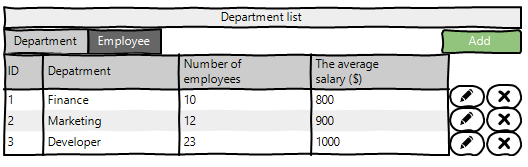
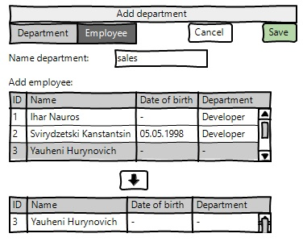
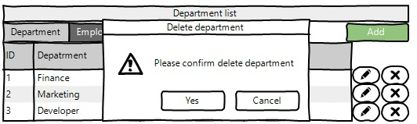
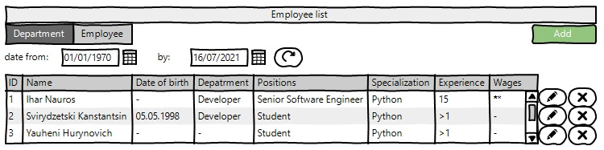
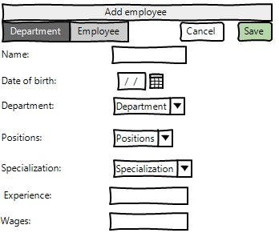
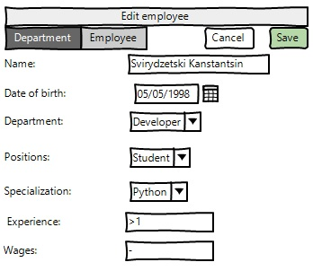

<h2 align="center">Managing departments and employees</h2>

<!--TABLE OF CONTENTS-->

  
Table of Contents

  <ol>
    <li>
      <a href="#vision">Vision</a>
    </li>
    <li>
      <a href="#department">Department</a>
      <ul>
        <li><a href="#display-list-of-department">Display list of department</a></li>
        <li><a href="#add-department">Add department</a></li>
        <li><a href="#edit-department">Edit department</a></li>
        <li><a href="#removing-the-department">Removing the department</a></li>
      </ul>
    </li>
    <li>
        <a href="#employee">Employee</a>
        <ul>
        <li><a href="#display-list-of-employee">Display list of employee</a></li>
        <li><a href="#add-employee">Add employee</a></li>
        <li><a href="#edit-employee">Edit employee</a></li>
        <li><a href="#removing-the-employee">Removing the employee</a></li>
        </ul>
    </li>
  </ol>

<!--/TABLE OF CONTENTS-->

<!--VISION-->
## Vision

"Department and Employee Management" is a web application that allows an administrator to record information about a department and an employee.

Application should provide:

* Storing list of department and list of employee in a database;
* Display list of department and the average salary for these departments;
* Updating the list of department (adding, editing, removing);
* Display list of employee in the departments with an indication of the salary for each employee;
* Updating the list of employee (adding, editing, removing);
* Filtering by employees born on a certain date or in the period between dates.
<!--/VISION-->

<!--DEPARTMENT-->
## Department
### Display list of department

The mode is designed to view the list of department.

<b>Main scenario:</b>
* User selects item “Department”;
* Application displays list of Department.

Pic. 2.1 View the Department list.

The list displays the following columns:
* ID – unique department number;
* Nubmer of employees - the number of employees in this department
* The average salary ($) - average salary of all employees of the department
### Add department

<b>Main scenario:</b>
* Administrator clicks the “Add” button in the department list view mode;
* Application displays form to enter department data;
* Administrator enters department data and presses “Save” button;
* If any data is entered incorrectly, incorrect data messages are displayed;
* If entered data is valid, then record is adding to database;
* If error occurs, then error message is displaying;
* If new department record is successfully added, then list of departments with added records is displaying.

<b>Cancel operation scenario:</b>
* Administrator clicks the “Add” button in the department list view mode;
* Application displays form to enter department data;
* Administrator enters department data and presses “Cancel” button;
* Data don’t save in data base, then list of departments records is displaying to administrator.
* If the administrator selects the menu item "Department ”or "Employee", the data will not be saved to the database and the corresponding form with updated data will be opened.

 Pic. 2.2 Add department.

<b>When adding a department, the following details are entered:</b>
* Name department - name department
* Add employee - adding department employees(optional field)
### Edit department

<b>Main scenario:</b>
* Administrator clicks the “Edit” button in the department list view mode;
* Application displays form to enter department data;
* Administrator edit department data and presses “Save” button;
* If any data is entered incorrectly, incorrect data messages are displayed;
* If entered data is valid, then edited data is added to database;
* If error occurs, then error message is displaying;
* If department record is successfully edited, then list of departments with added records is displaying. 

<b>Cancel operation scenario:</b>
* Administrator clicks the “Edit” button in the department list view mode;
* Application displays form to enter department data;
* Administrator enters department data and presses “Cancel” button;
* Data don’t save in data base, then list of departments records is displaying to administrator.
* If the administrator selects the menu item "Department ” or "Employee", the data will not be saved to the database and the corresponding form with updated data will be opened.

 Pic. 2.3 Edit department.

<b>When editing a order, the following details are entered:</b>
* Name department - name department
* Add employee - adding department employees(optional field)

### Removing the department

<b>Main scenario:</b>
* Administrator, while in the list of departments presses the "Delete" button in the selected department line;
* If the department can be removed, a confirmation dialog is displayed;
* Administrator confirms the removal of the order;
* Record is deleted from database;
* If error occurs, then error message displays;
* If department record is successfully deleted, then list of departments without deleted records is displaying.

 Pic. 2.4 Delete department dialog.

<b>Cancel operation scenario:</b>
* Administrator is in display mode of department list and press “Delete” button;
* Application displays confirmation dialog “Please confirm delete department”;
* Administrator press “Cancel” button;
* List of departments without changes is displaying. 
<!--/DEPARTMENT-->

<!--EMPLOYEE-->
## Employee
### Display list of employee

This mode is intended for viewing and editing the employees list

<b>Main scenario:</b>
* User selects item “Employee”;
* Application displays list of Employee.

Pic. 3.1 View the Employee list.

<b>The list displays the following columns:</b>
* ID – unique employee number;
* Name - first name and last name
* Date of birth - employee's date of birth
* Department - the department in which the employee consists
* Positions - employee positions
* Specialization - skills that the employee has
* Experience - work experience
* Wages - employee's salary

<b>Filtering by date:</b>
* In the employee list view mode, the administrator sets a filter by date and clicks the update list button (to the right of the date input field).;
* The application will show employees only during a certain period of the date of birth.

<b>Restrictions:</b>
* Start date of the period should be less then end date of the period;
* If start date is blank, then filtering by end date only.
* If end date is blank, then filtering by start date only.
* Updating data after selecting the filtering conditions is carried out by pressing the “Refresh” button.

### Add employee

<b>Main scenario:</b>
* Administrator clicks the “Add” button in the employee list view mode;
* Application displays form to enter employee data;
* Administrator enters employee data and presses “Save” button;
* If any data is entered incorrectly, incorrect data messages are displayed;
* If entered data is valid, then record is adding to database;
* If error occurs, then error message is displaying;
* If new employee record is successfully added, then list of employees with added records is displaying.

<b>Cancel operation scenario:</b>
* Administrator clicks the “Add” button in the employees list view mode;
* Application displays form to enter employees data;
* User enters employees data and presses “Cancel” button;
* Data don’t save in data base, then list of employees records is displaying to administrator.
* If the administrator selects the menu item "Department ” or "Employee", the data will not be saved to the database and the corresponding form with updated data will be opened.

 Pic. 3.2 Add employee.

<b>When adding a employee, the following details are entered:</b>
* Name - first name and last name
* Date of birth - employee's date of birth
* Department - the department in which the employee consists
* Positions - employee positions
* Specialization - skills that the employee has
* Experience - work experience
* Wages - employee's salary
### Edit employee

<b>Main scenario:</b>
* Administrator clicks the “Edit” button in the employee list view mode;
* Application displays form to enter employee data;
* Administrator enters employees data and presses “Save” button;
* If any data is entered incorrectly, incorrect data messages are displayed;
* If entered data is valid, then edited data is added to database;
* If error occurs, then error message is displaying;
* If employees record is successfully edited, then list of employees with added records is displaying.

Cancel operation scenario:
* Administrator clicks the “Edit” button in the employees list view mode;
* Application displays form to enter employees data;
* Administrator enters employee data and presses “Cancel” button;
* Data don’t save in data base, then list of employees records is displaying to Administrator.
* If the administrator selects the menu item "Department” or "Employee", the data will not be saved to the database and the corresponding form with updated data will be opened.

 Pic. 3.3 Edit employee.

### Removing the employee

<b>Main scenario:</b>
* The administrator, while in the list of employees mode, presses the "Delete" button in the selected client line;
* Application displays confirmation dialog “Please confirm delete client?”;
* The administrator confirms the removal of the client;
* Record is deleted from database;
* If error occurs, then error message displays;
* If employee record is successfully deleted, then list of employees without deleted records is displaying.

 Pic. 3.4 Delete department dialog.

<b>Cancel operation scenario:</b>
* Administrator is in display mode of employees list and press “Delete” button;
* Application displays confirmation dialog “Please confirm delete employee?”;
* Administrator press “Cancel” button;
* List of clients without changes is displaying.
<!--/EMPLOYEE-->