<h2 align="center">Managing departments and employees</h2>

<!--TABLE OF CONTENTS-->

  
Table of Contents

  <ol>
    <li>
      <a href="#vision">Vision</a>
    </li>
    <li>
      <a href="#department">Department</a>
      <ul>
        <li><a href="#display-list-of-department">Display list of department</a></li>
        <li><a href="#add-department">Add department</a></li>
        <li><a href="#edit-department">Edit department</a></li>
        <li><a href="#removing-the-department">Removing the department</a></li>
      </ul>
    </li>
    <li>
        <a href="#employee">Employee</a>
        <ul>
            <li><a href="#display-list-of-employee">Display list of employee</a></li>
            <li><a href="#add-employee">Add employee</a></li>
            <li><a href="#edit-employee">Edit employee</a></li>
            <li><a href="#removing-the-employee">Removing the employee</a></li>
        </ul>
    </li>
    <li>
        <a href="#positions">Positions</a>
        <ul>
            <li><a href="#display-list-of-positions">Display list of positions</a></li>
            <li><a href="#add-positions">Add positions</a></li>
            <li><a href="#edit-positions">Edit positions</a></li>
            <li><a href="#removing-the-positions">Removing the positions</a></li>
        </ul>
    </li>
    <li>
        <a href="#specialization">Specialization</a>
        <ul>
            <li><a href="#display-list-of-specialization">Display list of specialization</a></li>
            <li><a href="#add-specialization">Add specialization</a></li>
            <li><a href="#edit-specialization">Edit specialization</a></li>
            <li><a href="#removing-the-specialization">Removing the specialization</a></li>
        </ul>
    </li>
  </ol>

<!--/TABLE OF CONTENTS-->

<!--VISION-->
## Vision

"Department and Employee Management" is a web application that allows an administrator to record information about a department and an employee.

Application should provide:

* Storing list of department and list of employee in a database;
* Display list of department and the average salary for these departments;
* Updating the list of department (adding, editing, removing);
* Display list of employee in the departments with an indication of the salary for each employee;
* Updating the list of employee (adding, editing, removing);
* Filtering by employees born on a certain date or in the period between dates;
* Display list of positions;
* Updating the list of positions (adding, editing, removing);
* Display list of specialization;
* Updating the list of specialization (adding, editing, removing);
<!--/VISION-->

<!--DEPARTMENT-->
## Department
### Display list of department

The mode is designed to view the list of department.

<b>Main scenario:</b>
* User selects item “Department”;
* Application displays list of Department.

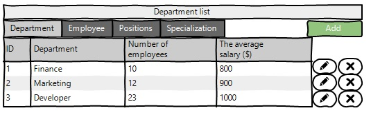
 Pic. 2.1 View the Department list.

The list displays the following columns:
* ID – unique department number;
* Department - department name;
* Nubmer of employees - the number of employees in this department
* The average salary ($) - average salary of all employees of the department
### Add department

<b>Main scenario:</b>
* Administrator clicks the “Add” button in the department list view mode;
* Application displays form to enter department data(pic. 2.2);
* Administrator enters department data and presses “Save” button;
* If any data is entered incorrectly, incorrect data messages are displayed(pic.2.3);
* If entered data is valid, then record is adding to database;
* If error occurs, then error message is displaying(pic. 2.4);
* If new department record is successfully added, then list of departments with added records is displaying.

<b>Cancel operation scenario:</b>
* Administrator clicks the “Add” button in the department list view mode;
* Application displays form to enter department data;
* Administrator enters department data and presses “Cancel” button;
* Data don’t save in data base, then list of departments records is displaying to administrator.
* If the administrator selects the menu item "Department", "Employee", "Positions" or "Specialization", the data will not be saved to the database and the corresponding form with updated data will be opened.

 Pic. 2.2 Add department.

<b>When adding a department, the following details are entered:</b>
* Name department - name department
* Add employee - adding department employees(optional field)

<b>If the data is entered incorrectly, it will display the corresponding error.</b>
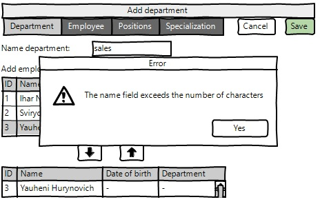
 Pic. 2.3 Error when adding.

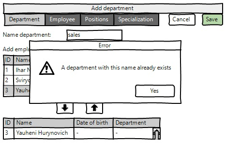
 Pic. 2.4 Error when adding.
### Edit department

<b>Main scenario:</b>
* Administrator clicks the “Edit” button in the department list view mode;
* Application displays form to enter department data(pic. 2.5);
* Administrator edit department data and presses “Save” button;
* If any data is entered incorrectly, incorrect data messages are displayed(pic. 2.6);
* If entered data is valid, then edited data is added to database;
* If error occurs, then error message is displaying(pic. 2.7);
* If department record is successfully edited, then list of departments with added records is displaying. 

<b>Cancel operation scenario:</b>
* Administrator clicks the “Edit” button in the department list view mode;
* Application displays form to enter department data;
* Administrator enters department data and presses “Cancel” button;
* Data don’t save in data base, then list of departments records is displaying to administrator.
* If the administrator selects the menu item "Department", "Employee", "Positions" or "Specialization", the data will not be saved to the database and the corresponding form with updated data will be opened.

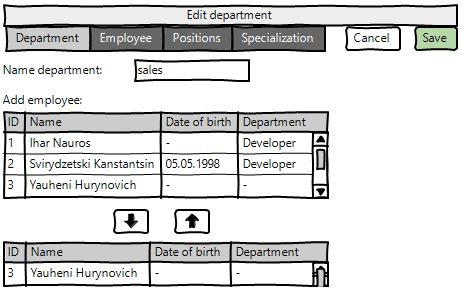
 Pic. 2.5 Edit department.

<b>When editing a department, the following details are entered:</b>
* Name department - name department
* Add employee - adding department employees(optional field)

<b>If the data is entered incorrectly, it will display the corresponding error.</b>
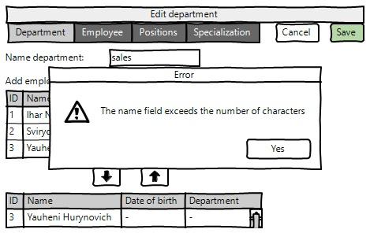
 Pic. 2.6 Error when editing.

 Pic. 2.7 Error when editing.
### Removing the department

<b>Main scenario:</b>
* Administrator, while in the list of departments presses the "Delete" button in the selected department line;
* If the department can be removed, a confirmation dialog is displayed;
* Administrator confirms the removal of the department;
* Record is deleted from database;
* If department record is successfully deleted, then list of departments without deleted records is displaying.

 Pic. 2.8 Delete department dialog.

<b>Cancel operation scenario:</b>
* Administrator is in display mode of department list and press “Delete” button;
* Application displays confirmation dialog “Please confirm delete department”;
* Administrator press “Cancel” button;
* List of departments without changes is displaying. 
<!--/DEPARTMENT-->

<!--EMPLOYEE-->
## Employee
### Display list of employee

This mode is intended for viewing and editing the employees list

<b>Main scenario:</b>
* User selects item “Employee”;
* Application displays list of Employee.

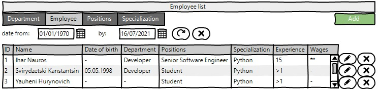
 Pic. 3.1 View the Employee list.

<b>The list displays the following columns:</b>
* ID – unique employee number;
* Name - first name and last name
* Date of birth - employee's date of birth
* Department - the department in which the employee consists
* Positions - employee positions
* Specialization - skills that the employee has
* Experience - work experience
* Wages - employee's salary

<b>Filtering by date:</b>
* In the employee list view mode, the administrator sets a filter by date and clicks the update list button (to the right of the date input field).;
* The application will show employees only during a certain period of the date of birth.
* If an incorrect date range is specified, it outputs an empty table;
* To reset the filter by date, click the reset button (to the right of the update button):

<b>Restrictions:</b>
* Start date of the period should be less then end date of the period;
* If start date is blank, then filtering by end date only.
* If end date is blank, then filtering by start date only.
* Updating data after selecting the filtering conditions is carried out by pressing the “Refresh” button.

### Add employee

<b>Main scenario:</b>
* Administrator clicks the “Add” button in the employee list view mode;
* Application displays form to enter employee data(pic. 3.2);
* Administrator enters employee data and presses “Save” button;
* If any data is entered incorrectly, incorrect data messages are displayed(pic. 3.3);
* If entered data is valid, then record is adding to database;
* If error occurs, then error message is displaying(pic. 3.4);
* If new employee record is successfully added, then list of employees with added records is displaying.

<b>Cancel operation scenario:</b>
* Administrator clicks the “Add” button in the employees list view mode;
* Application displays form to enter employees data;
* User enters employees data and presses “Cancel” button;
* Data don’t save in data base, then list of employees records is displaying to administrator.
* If the administrator selects the menu item "Department", "Employee", "Positions" or "Specialization", the data will not be saved to the database and the corresponding form with updated data will be opened.

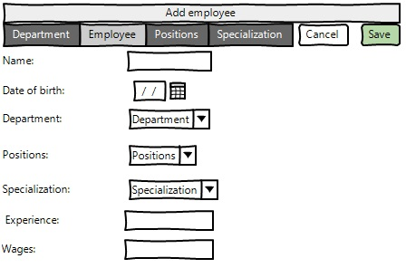
 Pic. 3.2 Add employee.

<b>When adding a employee, the following details are entered:</b>
* Name - first name and last name
* Date of birth - employee's date of birth
* Department - the department in which the employee consists (optional field)
* Positions - employee positions (optional field)
* Specialization - skills that the employee has (optional field)
* Experience - work experience
* Wages - employee's salary

<b>If the data is entered incorrectly, it will display the corresponding error.</b>

 Pic. 3.3 Error when adding.

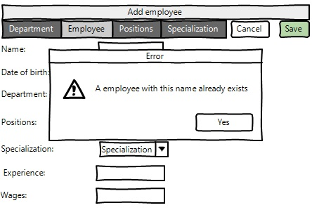
 Pic. 3.4 Error when adding.
### Edit employee

<b>Main scenario:</b>
* Administrator clicks the “Edit” button in the employee list view mode;
* Application displays form to enter employee data(pic. 3.5);
* Administrator enters employees data and presses “Save” button;
* If any data is entered incorrectly, incorrect data messages are displayed(pic. 3.6);
* If entered data is valid, then edited data is added to database;
* If error occurs, then error message is displaying(pic. 3.7);
* If employees record is successfully edited, then list of employees with added records is displaying.

Cancel operation scenario:
* Administrator clicks the “Edit” button in the employees list view mode;
* Application displays form to enter employees data;
* Administrator enters employee data and presses “Cancel” button;
* Data don’t save in data base, then list of employees records is displaying to Administrator.
* If the administrator selects the menu item "Department", "Employee", "Positions" or "Specialization", the data will not be saved to the database and the corresponding form with updated data will be opened.

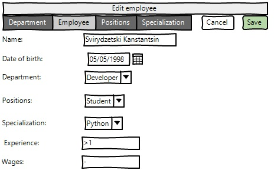
 Pic. 3.5 Edit employee.

<b>If the data is entered incorrectly, it will display the corresponding error.</b>
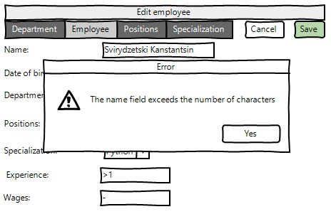
 Pic. 3.6 Error when editing.

 Pic. 3.7 Error when editing.
### Removing the employee

<b>Main scenario:</b>
* The administrator, while in the list of employees mode, presses the "Delete" button in the selected client line;
* Application displays confirmation dialog “Please confirm delete client?”;
* The administrator confirms the removal of the employee;
* Record is deleted from database;
* If employee record is successfully deleted, then list of employees without deleted records is displaying.

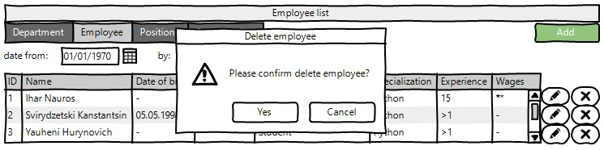
 Pic. 3.8 Delete department dialog.

<b>Cancel operation scenario:</b>
* Administrator is in display mode of employees list and press “Delete” button;
* Application displays confirmation dialog “Please confirm delete employee?”;
* Administrator press “Cancel” button;
* List of clients without changes is displaying.
<!--/EMPLOYEE-->

<!--POSITIONS-->
## Positions
### Display list of positions

The mode is designed to view the list of Positions.

<b>Main scenario:</b>
* User selects item “Positions”;
* Application displays list of Positions.

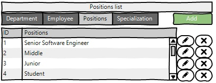
 Pic. 4.1 View the Positions list.

The list displays the following columns:
* ID – unique department number;
* Positions - positions name;
### Add positions

<b>Main scenario:</b>
* Administrator clicks the “Add” button in the positions list view mode;
* Application displays form to enter positions data(pic. 4.2);
* Administrator enters positions data and presses “Save” button;
* If any data is entered incorrectly, incorrect data messages are displayed(pic. 4.3);
* If entered data is valid, then record is adding to database;
* If error occurs, then error message is displaying(pic. 4.4);
* If new position record is successfully added, then list of positions with added records is displaying.

<b>Cancel operation scenario:</b>
* Administrator clicks the “Add” button in the positions list view mode;
* Application displays form to enter positions data;
* Administrator enters positions data and presses “Cancel” button;
* Data don’t save in data base, then list of positions records is displaying to administrator.
* If the administrator selects the menu item "Department", "Employee", "Positions" or "Specialization", the data will not be saved to the database and the corresponding form with updated data will be opened.

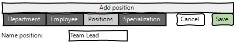
 Pic. 4.2 Add position.

<b>When adding a position, the following details are entered:</b>
* Name position - name position

<b>If the data is entered incorrectly, it will display the corresponding error.</b>
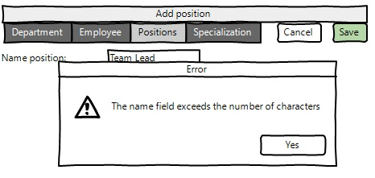
 Pic. 4.3 Error when adding.

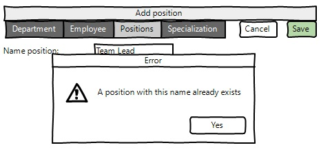
 Pic. 4.4 Error when adding.
### Edit positions

<b>Main scenario:</b>
* Administrator clicks the “Edit” button in the position list view mode;
* Application displays form to enter position data(pic. 4.5);
* Administrator edit position data and presses “Save” button;
* If any data is entered incorrectly, incorrect data messages are displayed(pic. 4.6);
* If entered data is valid, then edited data is added to database;
* If error occurs, then error message is displaying(pic. 4.7);
* If position record is successfully edited, then list of positions with added records is displaying. 

<b>Cancel operation scenario:</b>
* Administrator clicks the “Edit” button in the position list view mode;
* Application displays form to enter position data;
* Administrator enters position data and presses “Cancel” button;
* Data don’t save in data base, then list of positions records is displaying to administrator.
* If the administrator selects the menu item "Department", "Employee", "Positions" or "Specialization", the data will not be saved to the database and the corresponding form with updated data will be opened.

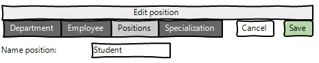
 Pic. 4.5 Edit position.

<b>When editing a position, the following details are entered:</b>
* Name position - name position

<b>If the data is entered incorrectly, it will display the corresponding error.</b>
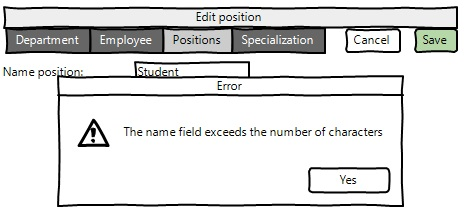
 Pic. 4.6 Error when editing.

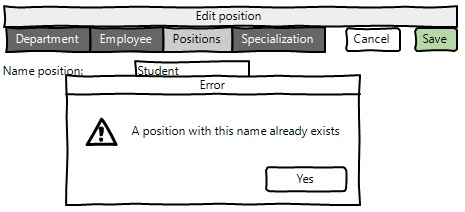
 Pic. 4.7 Error when editing.
### Removing the positions

<b>Main scenario:</b>
* Administrator, while in the list of positions presses the "Delete" button in the selected position line;
* If the position can be removed, a confirmation dialog is displayed;
* Administrator confirms the removal of the position;
* Record is deleted from database;
* If position record is successfully deleted, then list of positions without deleted records is displaying.

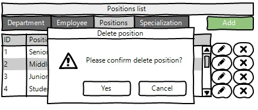
 Pic. 4.8 Delete position dialog.

<b>Cancel operation scenario:</b>
* Administrator is in display mode of position list and press “Delete” button;
* Application displays confirmation dialog “Please confirm delete position”;
* Administrator press “Cancel” button;
* List of departments without changes is displaying. 
<!--/POSITIONS-->

<!--SPECIALIZATION-->
## Specialization
### Display list of specialization

The mode is designed to view the list of Specializations.

<b>Main scenario:</b>
* User selects item “Specialization”;
* Application displays list of Specialization.

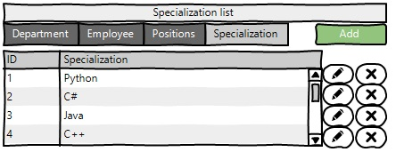
 Pic. 5.1 View the Specializations list.

The list displays the following columns:
* ID – unique department number;
* Specialization - specialization name;
### Add specialization

<b>Main scenario:</b>
* Administrator clicks the “Add” button in the specialization list view mode;
* Application displays form to enter specialization data(pic. 5.2);
* Administrator enters specialization data and presses “Save” button;
* If any data is entered incorrectly, incorrect data messages are displayed(pic. 5.3);
* If entered data is valid, then record is adding to database;
* If error occurs, then error message is displaying(pic. 5.4);
* If new specialization record is successfully added, then list of specialization with added records is displaying.

<b>Cancel operation scenario:</b>
* Administrator clicks the “Add” button in the specialization list view mode;
* Application displays form to enter specialization data;
* Administrator enters specialization data and presses “Cancel” button;
* Data don’t save in data base, then list of specialization records is displaying to administrator.
* If the administrator selects the menu item "Department", "Employee", "Positions" or "Specialization", the data will not be saved to the database and the corresponding form with updated data will be opened.

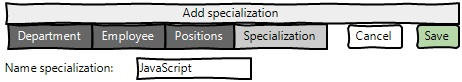
 Pic. 5.2 Add specialization.

<b>When adding a specialization, the following details are entered:</b>
* Name specialization - name specialization

<b>If the data is entered incorrectly, it will display the corresponding error.</b>
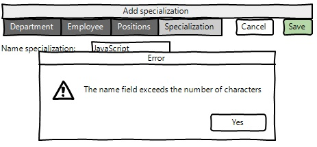
 Pic. 5.3 Error when adding.

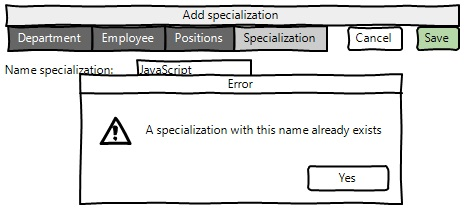
 Pic. 5.4 Error when adding.
### Edit specialization

<b>Main scenario:</b>
* Administrator clicks the “Edit” button in the specialization list view mode;
* Application displays form to enter specialization data(pic. 5.5);
* Administrator edit specialization data and presses “Save” button;
* If any data is entered incorrectly, incorrect data messages are displayed(pic. 5.6);
* If entered data is valid, then edited data is added to database;
* If error occurs, then error message is displaying(pic. 5.7);
* If specialization record is successfully edited, then list of specialization with added records is displaying. 

<b>Cancel operation scenario:</b>
* Administrator clicks the “Edit” button in the specialization list view mode;
* Application displays form to enter specialization data;
* Administrator enters specialization data and presses “Cancel” button;
* Data don’t save in data base, then list of specialization records is displaying to administrator.
* If the administrator selects the menu item "Department", "Employee", "Positions" or "Specialization", the data will not be saved to the database and the corresponding form with updated data will be opened.

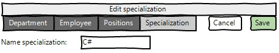
 Pic. 5.5 Edit specialization.

<b>When editing a specialization, the following details are entered:</b>
* Name specialization - name specialization

<b>If the data is entered incorrectly, it will display the corresponding error.</b>
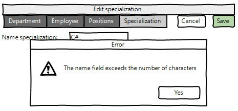
 Pic. 5.6 Error when editing.

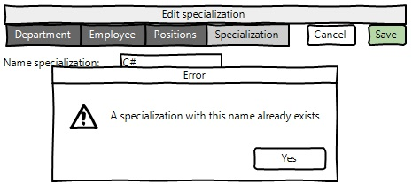
 Pic. 5.7 Error when editing.
### Removing the specialization

<b>Main scenario:</b>
* Administrator, while in the list of specialization presses the "Delete" button in the selected specialization line;
* If the specialization can be removed, a confirmation dialog is displayed;
* Administrator confirms the removal of the specialization;
* Record is deleted from database;
* If specialization record is successfully deleted, then list of specialization without deleted records is displaying.

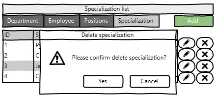
 Pic. 5.8 Delete specialization dialog.

<b>Cancel operation scenario:</b>
* Administrator is in display mode of specialization list and press “Delete” button;
* Application displays confirmation dialog “Please confirm delete specialization?”;
* Administrator press “Cancel” button;
* List of specialization without changes is displaying. 
<!--/SPECIALIZATION-->